# GemBrawl Architecture

## Mermaid Diagram

```mermaid
graph TB
    %% Main Entry Points
    Main[main.gd<br/>Entry Point]
    MainGame[MainGame.tscn<br/>Main Game Scene]
    
    %% Scenes
    LocalMultiplayer[LocalMultiplayerGame.tscn<br/>Local MP Scene]
    PracticeArena[PracticeArena.tscn<br/>Practice Scene]
    HexArenaGameplay[HexArenaGameplay.tscn<br/>Hex Arena Scene]
    
    %% Arena System
    ArenaBase[ArenaBase.gd<br/>Arena Base Script]
    HexArena[HexArena.gd<br/>Hex Arena Script]
    HexGrid[HexGrid.gd<br/>Hex Grid Utilities]
    Arena1[Arena1.tscn<br/>Arena Scene]
    Arena2[Arena2.tscn<br/>Arena Scene]
    Tile[Tile.tscn<br/>Floor Tile]
    TrapTile[TrapTile.tscn<br/>Hazard Tile]
    SpawnPoint[SpawnPoint.tscn<br/>Spawn Point]
    
    %% Character System
    PlayerCharacter[PlayerCharacter.gd<br/>Player Controller]
    PlayerCharacterScene[PlayerCharacter.tscn<br/>Player Scene]
    PlayerMovement[PlayerMovement.gd<br/>Movement Component]
    PlayerCombat[PlayerCombat.gd<br/>Combat Component]
    PlayerStats[PlayerStats.gd<br/>Stats Component]
    PlayerInput[PlayerInput.gd<br/>Input Component]
    Gem[Gem.gd<br/>Gem Resource]
    GemResource[GemResource.gd<br/>Gem Data]
    
    %% Skill System
    SkillBase[SkillBase.gd<br/>Skill Base]
    Skill[Skill.gd<br/>Skill Interface]
    CutSkill[CutSkill.gd<br/>Cut Skill]
    PolishSkill[PolishSkill.gd<br/>Polish Skill]
    ShineSkill[ShineSkill.gd<br/>Shine Skill]
    AoeAttack[AoeAttack.gd<br/>AOE Attack]
    Projectile[Projectile.gd<br/>Projectile]
    MeleeHitbox[MeleeHitbox.gd<br/>Melee Hitbox]
    
    %% Combat System
    CombatManager[CombatManager.gd<br/>Combat Manager<br/>*Singleton*]
    DamageSystem[DamageSystem.gd<br/>Damage Calculator]
    Hitbox[Hitbox.gd<br/>Hitbox Component]
    CombatLayers[CombatLayers.gd<br/>Physics Layers]
    
    %% UI System
    CombatUI[CombatUI.gd/.tscn<br/>Combat UI]
    HUD[HUD.tscn<br/>HUD Scene]
    HUDManager[HUDManager.gd<br/>HUD Manager]
    HealthBar[HealthBar.gd/.tscn<br/>Health Bar]
    
    %% Effects
    DamageNumber[DamageNumber.gd/.tscn<br/>Damage Numbers]
    AoeVisual[AoeVisual.gd<br/>AOE Visuals]
    
    %% Camera System
    CameraController[CameraController.gd<br/>Camera Controller]
    SimpleCamera[SimpleCamera.gd<br/>Simple Camera]
    
    %% Global Systems
    GameState[GameState.gd<br/>Game State<br/>*Global*]
    AudioManager[AudioManager.gd<br/>Audio Manager<br/>*Global*]
    MatchConfig[MatchConfig.gd<br/>Match Config<br/>*Global*]
    SceneLoader[SceneLoader.gd<br/>Scene Loader<br/>*Global*]
    
    %% Multiplayer
    NetworkManager[NetworkManager.gd<br/>Network Manager]
    LobbyManager[LobbyManager.gd<br/>Lobby Manager]
    
    %% Relationships - Scene Hierarchy
    Main --> MainGame
    MainGame --> LocalMultiplayer
    MainGame --> PracticeArena
    LocalMultiplayer --> HexArenaGameplay
    
    %% Arena Relationships
    HexArenaGameplay --> HexArena
    HexArena --> HexGrid
    HexArena --> Tile
    HexArena --> TrapTile
    HexArena --> SpawnPoint
    HexArena -.-> ArenaBase
    Arena1 -.-> ArenaBase
    Arena2 -.-> ArenaBase
    
    %% Player Relationships
    HexArenaGameplay --> PlayerCharacterScene
    PlayerCharacterScene --> PlayerCharacter
    PlayerCharacter --> PlayerMovement
    PlayerCharacter --> PlayerCombat
    PlayerCharacter --> PlayerStats
    PlayerCharacter --> PlayerInput
    PlayerCharacter --> Gem
    Gem --> GemResource
    
    %% Skill Relationships
    PlayerCharacter --> Skill
    Skill -.-> SkillBase
    CutSkill -.-> Skill
    PolishSkill -.-> Skill
    ShineSkill -.-> Skill
    AoeAttack -.-> Skill
    Skill --> Projectile
    Skill --> MeleeHitbox
    Skill --> AoeAttack
    
    %% Combat Relationships
    PlayerCharacter --> Hitbox
    Skill --> DamageSystem
    DamageSystem --> CombatManager
    Hitbox --> CombatLayers
    Projectile --> CombatLayers
    MeleeHitbox --> CombatLayers
    
    %% UI Relationships
    HexArenaGameplay --> HUD
    HUD --> HUDManager
    HUD --> CombatUI
    CombatUI --> HealthBar
    
    %% Effect Relationships
    CombatManager --> DamageNumber
    Skill --> AoeVisual
    
    %% Camera Relationships
    HexArenaGameplay --> CameraController
    CameraController -.-> SimpleCamera
    
    %% Global System Access
    PlayerCharacter -.-> GameState
    HexArenaGameplay -.-> GameState
    CombatManager -.-> GameState
    PlayerCharacter -.-> AudioManager
    MainGame -.-> SceneLoader
    LocalMultiplayer -.-> MatchConfig
    
    %% Multiplayer Relationships
    LocalMultiplayer --> NetworkManager
    NetworkManager --> LobbyManager
    
    %% Signals (Key ones)
    PlayerCharacter -.->|health_changed<br/>defeated<br/>skill_used| CombatUI
    CombatManager -.->|combat_hit<br/>player_killed| HUDManager
    PlayerCharacter -.->|hex_entered| HexArena
    CombatManager -.->|combo_achieved| AudioManager
    
    %% Test Scenes
    TestHex[TestHex.tscn<br/>Basic Hex Test]
    TestCombatScene[TestCombat.tscn<br/>Combat Skills Test]
    TestArenaGameplay[TestArenaGameplay.tscn<br/>Multi-Player Arena Test]
    TestArenaGameplayController[TestArenaGameplayController.gd<br/>Multi-Player Test]
    TestCombatController[TestCombatController.gd<br/>Single Player Test]
    TestAOE[TestAOE.tscn<br/>AoE Skill]
    TestMeleeHitbox[TestMeleeHitbox.tscn<br/>Melee Skill]
    TestProjectile[TestProjectile.tscn<br/>Projectile Skill]
    
    %% Test Scene Relationships
    TestHex --> HexArena
    TestHex --> PlayerCharacterScene
    TestCombatScene --> TestCombatController
    TestCombatScene --> PlayerCharacterScene
    TestCombatScene --> TestAOE
    TestCombatScene --> TestMeleeHitbox
    TestCombatScene --> TestProjectile
    TestArenaGameplay --> TestArenaGameplayController
    TestArenaGameplay --> HexArena
    TestArenaGameplay --> CombatUI
    
    %% Legend
    classDef scene fill:#f9f,stroke:#333,stroke-width:2px
    classDef script fill:#9cf,stroke:#333,stroke-width:2px
    classDef node fill:#9f9,stroke:#333,stroke-width:2px
    classDef singleton fill:#ff9,stroke:#333,stroke-width:2px
    classDef signal fill:#fcc,stroke:#333,stroke-width:2px,stroke-dasharray: 5 5
    classDef test fill:#fcf,stroke:#333,stroke-width:2px
    
    class MainGame,LocalMultiplayer,PracticeArena,HexArenaGameplay,Arena1,Arena2,PlayerCharacterScene,Tile,TrapTile,SpawnPoint,HUD,CombatUI,HealthBar,DamageNumber scene
    class Main,ArenaBase,HexArena,HexGrid,PlayerCharacter,PlayerMovement,PlayerCombat,PlayerStats,PlayerInput,Gem,GemResource,SkillBase,Skill,CutSkill,PolishSkill,ShineSkill,AoeAttack,Projectile,MeleeHitbox,DamageSystem,Hitbox,CombatLayers,HUDManager,AoeVisual,CameraController,SimpleCamera,NetworkManager,LobbyManager script
    class CombatManager,GameState,AudioManager,MatchConfig,SceneLoader singleton
    class TestHex,TestCombatScene,TestArenaGameplay,TestAOE,TestMeleeHitbox,TestProjectile test
    class TestCombatController,TestArenaGameplayController script
```

## Architecture Overview

### Core Components

1. **Scenes** (Pink) - Godot scene files (.tscn) that define the visual and structural hierarchy
2. **Scripts** (Light Blue) - GDScript files (.gd) containing game logic
3. **Nodes** (Light Green) - Godot node types that make up the scene tree
4. **Singletons** (Yellow) - Global autoloaded scripts accessible from anywhere

### Key Systems

#### Arena System
- **HexArena** generates hexagonal grid-based arenas
- Uses **HexGrid** utilities for coordinate conversions
- Creates floor tiles, trap tiles, and spawn points

#### Character System
- **PlayerCharacter** is the main player controller using a component-based architecture
  - **PlayerMovement** - Handles all movement logic (free and hex-based)
  - **PlayerCombat** - Manages damage, defense, and skill usage
  - **PlayerStats** - Tracks health, lives, and respawn logic
  - **PlayerInput** - Processes keyboard and gamepad input
- Each player has a **Gem** resource defining their stats and abilities
- Supports both free movement and hex-snapped movement

#### Combat System
- **CombatManager** (singleton) tracks all combat events
- **DamageSystem** calculates damage based on types and elemental effectiveness
- **Hitbox** components handle collision detection
- **CombatLayers** defines what can collide with what

#### Skill System
- **Skill** base class extended by specific skills (Cut, Polish, Shine)
- Skills can create **Projectiles**, **MeleeHitboxes**, or **AoeAttacks**
- Each skill has cooldowns and visual effects

#### UI System
- **HUD** displays player health, skills, and combat information
- **CombatUI** shows damage numbers and combat feedback
- **HealthBar** visualizes player health

### Signals

Key signals connect different systems:
- `health_changed`, `defeated`, `skill_used` - From PlayerCharacter to UI
- `combat_hit`, `player_killed` - From CombatManager to various systems
- `hex_entered` - From PlayerCharacter to HexArena for position tracking
- `combo_achieved` - From CombatManager to AudioManager for sound effects

### Global Systems

- **GameState** - Manages overall game state
- **AudioManager** - Handles all audio playback
- **MatchConfig** - Stores match configuration
- **SceneLoader** - Manages scene transitions

The architecture follows Godot best practices with clear separation of concerns, signal-based communication, and a component-based design that makes it easy to extend with new features.