# Gembrawl Project Structure & Documentation

## 📁 Recommended File Tree

```plaintext
res://
├─ assets/
│   ├─ audio/
│   ├─ fonts/
│   ├─ sprites/
│   ├─ tilesets/
│   └─ models/
│
├─ ui/
│   ├─ menus/
│   │   ├─ SplashScreen.tscn
│   │   ├─ SettingsScreen.tscn
│   │   ├─ LocalMultiplayerScreen.tscn
│   │   ├─ ControllerAssignmentScreen.tscn
│   │   ├─ LobbySearchScreen.tscn
│   │   ├─ LobbySetupScreen.tscn
│   │   ├─ ControllerSelectionScreen.tscn
│   │   ├─ CharacterSelectScreen.tscn
│   │   └─ ArenaSelectScreen.tscn
│   ├─ hud/
│   │   ├─ HUD.tscn
│   │   ├─ HealthBar.tscn
│   │   ├─ CooldownDisplay.tscn
│   │   └─ LivesCounter.tscn
│   ├─ UIManager.gd
│
├─ game/
│   ├─ MainGame.tscn
│   ├─ PracticeMode.tscn
│   ├─ PracticeArena.tscn
│   ├─ LocalMultiplayerGame.tscn
│   └─ CameraController.gd
│
├─ arena/
│   ├─ ArenaBase.tscn
│   ├─ Arena1.tscn
│   ├─ Arena2.tscn
│   ├─ Tile.tscn
│   ├─ TrapTile.tscn
│   ├─ EdgeTile.tscn
│   ├─ FallZone.tscn
│   └─ SpawnPoint.tscn
│
├─ characters/
│   ├─ PlayerCharacter.tscn
│   ├─ ai/
│   │   ├─ EnemyAI.tscn
│   │   └─ behaviors/
│   │        ├─ BasicBot.gd
│   │        └─ AdvancedDodgeBot.gd
│   ├─ classes/
│   │   ├─ Brawler.tscn
│   │   ├─ Mage.tscn
│   │   └─ [OtherClasses].tscn
│   ├─ skills/
│   │   ├─ SkillBase.tscn
│   │   ├─ CommonSkill1.tscn
│   │   └─ ClassSkill1.tscn
│   ├─ data/
│   │   ├─ skills/
│   │   │   ├─ glide.tres
│   │   │   └─ refract.tres
│   │   └─ classes/
│   │        ├─ ruby.tres
│   │        └─ sapphire.tres
│   ├─ stats/
│   │   └─ [class_stats].tres
│   └─ states/
│        ├─ BaseState.gd
│        ├─ Idle.gd
│        ├─ Attack.gd
│        └─ Refract.gd
│
├─ effects/
│   ├─ HitFlash.tscn
│   ├─ GlideTrail.tscn
│   ├─ ShineAOE.tscn
│   ├─ DeathExplosion.tscn
│   ├─ FallEffect.tscn
│   ├─ EdgeCollapseEffect.tscn
│   └─ VFXManager.gd
│
├─ scripts/
│   ├─ StateMachine.gd
│   ├─ CooldownTimer.gd
│   ├─ Hitbox.gd
│   └─ EventBus.gd
│
├─ control/
│   ├─ ControllerManager.gd
│   ├─ LocalControllerManager.gd
│   ├─ InputMapping.gd
│   └─ DebugOverlay.gd
│
├─ multiplayer/
│   ├─ NetworkManager.gd
│   └─ LobbyManager.gd
│
├─ globals/
│   ├─ GameState.gd
│   ├─ MatchConfig.gd
│   ├─ AudioManager.gd
│   └─ SceneLoader.gd
│
├─ replay/
│   ├─ MatchRecorder.gd
│   └─ [replay_data].json
│
├─ utils/
│   ├─ SaveLoad.gd
│   └─ Helpers.gd
│
├─ logs/
│   ├─ DebugLog.gd
│   └─ [match_logs].txt
│
├─ main.gd
└─ project.godot
```

## 📚 Directory & File Documentation

### **assets/**
- **audio/**: All sound effects, music tracks, and audio assets.
- **fonts/**: Font files used in UIs or HUDs.
- **sprites/**: 2D sprite images, textures, and related sheets.
- **tilesets/**: Collections of tile graphics for arenas.
- **models/**: 3D models or meshes if needed.

### **ui/**
- **menus/**: Scenes for each major menu/screen (splash, settings, lobby, selection).
- **LocalMultiplayerScreen.tscn**: Initial screen for local multiplayer setup.
- **ControllerAssignmentScreen.tscn**: Screen for players to claim controllers with visual feedback.
- **hud/**: HUD interface elements (overlay during matches), health bars, cooldowns, lives, etc.
- **UIManager.gd**: Code for global menu navigation, screen transitions, and persistence.

### **game/**
- **MainGame.tscn**: The primary battle scene node.
- **PracticeMode.tscn/practiceArena.tscn**: Isolated environments for skill tests, AI training, or practice.
- **LocalMultiplayerGame.tscn**: Local multiplayer game scene supporting 2-4 players on one machine.
- **CameraController.gd**: Manages dynamic in-game camera logic.

### **arena/**
- **ArenaBase.tscn**: Base scene for all arenas.
- **Arena1/2.tscn**: Specific arena layouts.
- **Tile.tscn/TrapTile.tscn**: Scene files for basic and interactive tiles.
- **EdgeTile.tscn**: Breakable tiles at arena edges that can collapse.
- **FallZone.tscn**: Areas around arena perimeter that trigger fall mechanics.
- **SpawnPoint.tscn**: Defines player respawn/spawn locations.

### **characters/**
- **PlayerCharacter.tscn**: Root scene for all player-controlled characters.
- **ai/**: Enemy/AI logic with behaviors subdivided for scalability.
- **classes/**: Scenes for each unique character class.
- **skills/**: Scenes/resources for skills—common and class-exclusive.
- **data/**: Data files (`.tres`) for skills/classes for easy editing and modding.
- **stats/**: Resource files defining class stat values.
- **states/**: Scripts implementing player/skill state machines (idle, attack, etc.).

### **effects/**
- **HitFlash.tscn, GlideTrail.tscn, etc.**: Visual effects scenes.
- **FallEffect.tscn**: Visual effect for players falling off arena.
- **EdgeCollapseEffect.tscn**: Effect for edge tiles breaking/collapsing.
- **VFXManager.gd**: Handles spawning, pooling, and managing effects.

### **scripts/**
- **StateMachine.gd, Hitbox.gd, etc.**: Reusable logic scripts, not tied to a specific folder/domain.

### **control/**
- **ControllerManager.gd**: Handles controller detection and assignments.
- **LocalControllerManager.gd**: Manages multiple controller assignment for local multiplayer.
- **InputMapping.gd**: User/controller button configuration.
- **DebugOverlay.gd**: In-game debug overlay for input and diagnostics.

### **multiplayer/**
- **NetworkManager.gd/LobbyManager.gd**: Multiplayer coordination, matchmaking, and lobby handling.

### **globals/**
- **GameState.gd**: Tracks match state, scores, lives.
- **MatchConfig.gd**: Holds pre-match selected data (arena, players, rules).
- **AudioManager.gd**: Manages audio playback, transitions, mute states.
- **SceneLoader.gd**: Loads/unloads scenes globally.

### **replay/**
- **MatchRecorder.gd**: Records events for replay and debugging.
- **[replay_data].json**: Stored match or session replays.

### **utils/**
- **SaveLoad.gd**: Game settings or profile save/load logic.
- **Helpers.gd**: Miscellaneous helper functions.

### **logs/**
- **DebugLog.gd**: Logging utility for errors or analytic data.
- **[match_logs].txt**: Saved logs from matches for review.

### **main.gd/project.godot**
- Entry point script (main.gd) and project configuration file.

## 🔗 Mermaid Diagram: Node, Scene & Signal Structure

```mermaid
graph TD
  %% UI Layer
  UIManager -.-> SplashScreen
  UIManager -.-> SettingsScreen
  UIManager -.-> LobbySearchScreen
  UIManager -.-> LobbySetupScreen
  UIManager -.-> ControllerSelectionScreen
  UIManager -.-> CharacterSelectScreen
  UIManager -.-> ArenaSelectScreen
  MainGame --> HUD

  %% Game Layer
  MainGame --> ArenaBase
  MainGame --> Players
  MainGame --> CameraController
  Players --> PlayerCharacter
  Players --> EnemyAI
  PlayerCharacter --> Classes
  PlayerCharacter --> Skills
  PlayerCharacter -- Signals --> HUD
  EnemyAI --> behaviors

  %% Arena Layer
  ArenaBase --> Tile
  ArenaBase --> TrapTile
  ArenaBase --> SpawnPoint

  %% Effects & Managers
  MainGame --> VFXManager
  PlayerCharacter -- EmitSignal --> VFXManager
  ArenaBase -- Triggers --> VFXManager

  %% Globals
  MainGame --> GameState
  MainGame --> MatchConfig
  MainGame --> AudioManager

  %% Multiplayer
  UIManager -.-> LobbyManager
  MainGame --> NetworkManager

  %% Practice
  PracticeMode --> PracticeArena
  PracticeArena --> ArenaBase
  PracticeArena --> PlayerCharacter
  PracticeArena --> EnemyAI

  %% Signals examples
  PlayerCharacter -- "took_damage" --> HUD
  EnemyAI -- "defeated" --> GameState
  ArenaBase -- "trap_activated" --> VFXManager
  MatchRecorder -- "replay_saved" --> Logs
```



## 💡 Usage Tips

- Use this structure as a living document: adapt as team size, game features, or workflow evolves.
- Document major scripts/scenes with inline comments and/or README files for clarity.
- Modularization and clear node/signal paths will keep the project scalable and easy to debug.

This design will set a solid foundation for Gembrawl, supporting organized development and future enhancements.
