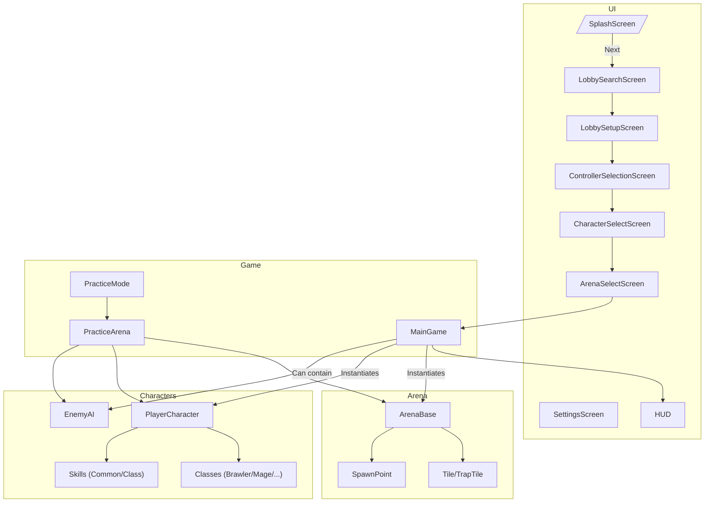

## Suggested Godot Project Structure for a Brawler Arena Game

Below is a **recommended scene and file tree breakdown** for your described features, reflecting clean modularity, reusability, and Godot best practices.

### File Tree Layout (Suggested)

```
res://
│
├─ assets/
│   ├─ audio/
│   ├─ fonts/
│   ├─ sprites/
│   ├─ tilesets/
│   └─ models/
│
├─ ui/
│   ├─ SplashScreen.tscn
│   ├─ SettingsScreen.tscn
│   ├─ Lobby/LobbySearchScreen.tscn
│   ├─ Lobby/LobbySetupScreen.tscn
│   ├─ ControllerSelectionScreen.tscn
│   ├─ CharacterSelectScreen.tscn
│   └─ ArenaSelectScreen.tscn
│
├─ game/
│   ├─ MainGame.tscn
│   ├─ PracticeMode.tscn
│   ├─ PracticeArena.tscn
│   └─ CameraController.gd
│
├─ arena/
│   ├─ ArenaBase.tscn
│   ├─ Arena1.tscn
│   ├─ Arena2.tscn
│   ├─ Tile.tscn
│   ├─ TrapTile.tscn
│   └─ SpawnPoint.tscn
│
├─ characters/
│   ├─ PlayerCharacter.tscn
│   ├─ EnemyAI.tscn
│   ├─ classes/
│   │   ├─ Brawler.tscn
│   │   ├─ Mage.tscn
│   │   └─ [OtherClasses].tscn
│   ├─ skills/
│   │   ├─ SkillBase.tscn
│   │   ├─ CommonSkill1.tscn
│   │   └─ ClassSkill1.tscn
│   └─ stats/
│        ├─ [class_stats].tres
│
├─ control/
│   ├─ ControllerManager.gd
│   └─ InputMapping.gd
│
├─ multiplayer/
│   ├─ NetworkManager.gd
│   └─ LobbyManager.gd
│
├─ utils/
│   ├─ SaveLoad.gd
│   └─ Helpers.gd
│
├─ main.gd
└─ project.godot
```

### Description of Core Scenes & Nodes

- **UI Scenes**: Each primary UI state is a separate `Control`-based scene for organization and modular navigation.
- **game/MainGame.tscn**: Main battle scene, instantiates arena, players, HUD, etc.
- **arena/ArenaBase.tscn**: Arena root node. Contains child nodes for tiles, spawn points, and interactive arena components.
- **characters/PlayerCharacter.tscn**: Scene for players, extended by individual class scenes (composition/inheritance).
- **characters/classes/**: Each character class is a scene, potentially extending `PlayerCharacter` or using it as a child node.
- **characters/skills/**: Skills are packed scenes or resources, attached to characters as needed.
- **multiplayer/**: Network and lobby setup handled by dedicated scripts.
- **control/**: Manages device enumeration, input profiles, and assignments.

### Typical Node Structure (Example: MainGame.tscn)

```
MainGame (Node or Node2D/3D)
├─ ArenaInstance (instance of arena/ArenaBase.tscn)
├─ Players (Node)
│   ├─ Player1 (instance of characters/PlayerCharacter.tscn)
│   ├─ Player2 ...
│   └─ EnemyAI (practice mode)
├─ CameraController (Camera2D or Camera3D)
├─ HUD (instance of relevant UI scene)
└─ GameManager (script, e.g., for score, respawn logic)
```

### Mermaid Diagram

Here’s a **Mermaid plot** outlining the relationships between major scenes and nodes:



**Tips:**

- **Scenes:** Use inheritance and composition for modularity (e.g., base `PlayerCharacter` that specialized classes inherit from).
- **UI Navigation:** Use a central manager or Godot’s scene switching to move between UI states.
- **Arena/Characters:** Prefabricate reusable elements (tiles, spawn points, skills) as scenes for drag-and-drop use.
- **Controller Input:** Centralize gamepad/keyboard input mapping with extensible scripts/scenes.
- **Networking:** Place multiplayer scripts in their own folder for clarity.

This approach will help keep your Godot project scalable, maintainable, and version-control-friendly as it grows.
